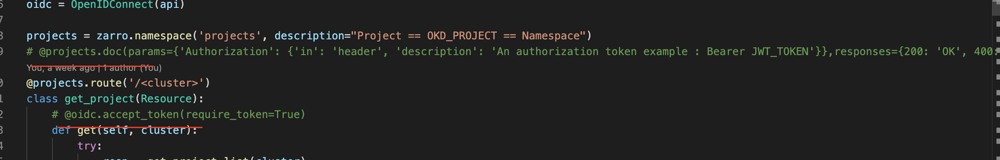
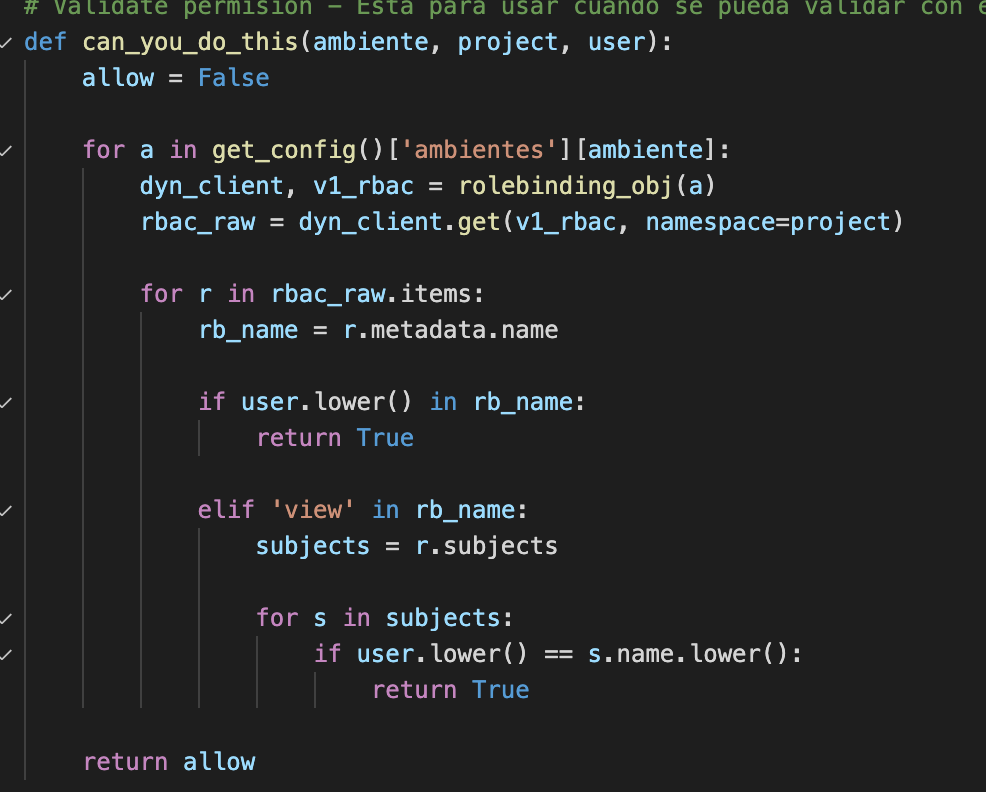

## Arquitectura
## Despliegue

#### Despliegue de 0
+ Deployment, `oc apply -f ocp/deployment.yaml`

+ Service, `oc apply -f ocp/service.yaml`

+ Routes `oc apply -f ocp/az1/route.yaml oc apply -f ocp/az2/route.yaml`

+ Secret, `Obtener el json del kdbx`

#### Re-despliegue
Debe recompilarse la imagen y borrar el pod para que pueda bajar la nueva imagen.
	
## Integracion

#### Openshift
Para agregar un nuevo cluster debe crearse una `serviceaccount` con permisos de administrador en todos los namespace ya que es la que se utiliza para impersonalizarse al momento de ejecutar las acciones. Y agregarse en el archivo del secret. La sa que se usa se llama `pizarro` y se puede encontrar en el namespace `default`.

#### KeyCloack
Los archivos de configuracion estan en `conf/client_secrets.json`, por ahora esta apuntando al keycloack de jmeter, esto deberia migrar a una instancia mejor controlada (que no muera la base de postgres) o directamente con el rhsso, crear un relam que incluya a todos los usuarios de openshift. Tal vez este dato pueda sacarse de grafana de sreobservability.

### Elasticsearch dentro de OCP
Por websocket, por desgracia no hay una mejor forma.

## Futuro

#### JWT
Si bien la integracion esta hecha esta comentado deberia quitarse y aprovechar para revisar de que manera obtener el nombre de usuario a traves del mismo y validar los roles que tenga este dentro del namespace con el que intenta interactuar. Esto seria solo si dumbo no va a hacer este laburo, sino con que el jwt sea valido no importa el tema de los permisos.

#### Validacion de permisos
Con esta funciona van a poder validar que el usuario que esta llamando tenga permisos de realizar las acciones en caso que se requiera.

#### Notificaciones por mail
Las acciones mas polemicas deberia mandar un mail, asi mismo los errores de 401.

##### SA
Recortar los permisos de la serviceaccount

#### Front
Evaluar el tiempo que le va a llevar a devops agregar estos features o sumarse al front de jmter.

#### Red buttons label
Deberia crearse un cron que busque todas las quotas que tenga el annotation de `paas.apizarro/redbutton 'true'` y lo devuelva a los valores originales despues de X determinada cantidad de tiempo.